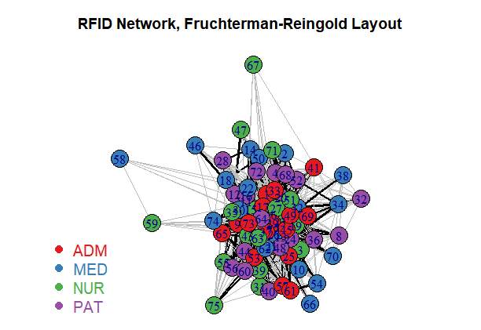

```{r setup, include=FALSE, warning=FALSE, cache=TRUE, message = FALSE}
knitr::opts_chunk$set(echo = TRUE)
library(igraph)
library(igraphdata)
library(RColorBrewer)
library(knitr)
library(dplyr)
library(lubridate)
library(ggplot2)
```
#### **Assessment Questions:**

Using a data set of your choosing from igraph. Do the following:

1. Plot a network with four different layouts of your choice. 
2. Choose one layout to label/annotate in any way you see fit (be biologically meaningful) 
3. Compute the degree, closeness, and betweenness centrality. 
4. Plot the network, sizing the nodes based on degree, or produce a plot of degree distrubution. 
5. Plot the results of one community detection algorithm applied to your network.
6. Add figure legends to each figure and a short paragraph at the end of the document 
  interpeting the biology of what is occuring in your network.
7. Give the code used in an Appendix  
\hfill\break

We'll start by looking at the basic layout of our chosen dataset:  
  
```{r echo=FALSE}
par(mar=c(0,0,0,0)+1)
```
```{r rfid-graph, echo=TRUE, cache=TRUE}
data(rfid)
plot(rfid,  main = "igraphdata RFID Dataset Network",
            sub = "Plotted with igraph Auto Layout")
```
```{r echo=FALSE}
par(mar=c(0,0,0,0))
```

\newpage

##### **Question One**

1. Plot a network with four different layouts of your choice.  
\hfill\break
```{r four-graphs, echo=TRUE, cache=TRUE, eval=FALSE}
data(rfid)

plot(rfid, layout = layout_with_graphopt, main = "RFID Network, Graphopt Layout")
plot(rfid, layout = layout_with_lgl, main = "RFID Network, Large Graph Layout")
plot(rfid, layout = layout_with_fr, main = "RFID Network, FR Layout")
plot(rfid, layout = layout_with_gem, main = "RFID Network, GEM Layout")
```

``` {r four-graphs-with-cords, echo=FALSE, cache=TRUE, eval=TRUE, keep.figs='all'}
cords_graphopt  <- layout.graphopt(rfid)
cords_lgl       <- layout.lgl(rfid)
cords_fr        <- layout.fruchterman.reingold(rfid)
cords_gem       <- layout.gem(rfid)

par(mfrow=c(2,2), mar=c(0,0,0,0)+2)

data(rfid)

plot(rfid, layout = cords_graphopt, main = "RFID Network, Graphopt Layout")
plot(rfid, layout = cords_lgl, main = "RFID Network, Large Graph Layout")
plot(rfid, layout = cords_fr, main = "RFID Network, FR Layout")
plot(rfid, layout = cords_gem, main = "RFID Network, GEM Layout")

par(mfrow = c(1, 1))
```
**Fig. 1. Four layots of the RFID dataset from the igraphdata package.** Layouts generated using different layout methods within the igraph package to demonstrate the difference in layout possiblities. 
\newpage

##### **Question Two **

2. Choose one layout to label/annotate in any way you see fit (be biologically meaningful) 
  
To make our graph interpretable, we color by the status of the individuals (their job role),
add edge weights to the edge width, and highlight key connections based on edge weight.  
  
```{r graph-attributes-all-fr, echo=TRUE, cache=TRUE, eval=FALSE}
# To find edge weights, we first assign each edge a value of 1 and then use simplify()
E(rfid)$weight <- 1
rfid_simple <- simplify(rfid, remove.multiple = TRUE, remove.loops = TRUE,
                        edge.attr.comb=list(weight="sum", Time = "ignore"))

# We then set the vertex color using a palette from RColorBrewer
vertex_colour <- brewer.pal(4, "Set1") 
E(rfid_simple)$color <- ifelse(E(rfid_simple)$weight > 10,"black", "grey")

plot(rfid_simple, layout = cords_fr, vertex.color = vertex_colour,
       edge.width = log(E(rfid_simple)$weight), edge.color = E(rfid_simple)$color,
     main = "RFID Network, Fruchterman-Reingold Layout")
     
legend("bottomleft", legend = levels(as.factor(V(rfid_simple)$Status)), 
         col = coul , bty = "n", pch=20 , pt.cex = 2, cex = 1.25, 
         text.col=coul , horiz = FALSE, inset = c(0.0, 0.0))
```
```{r fr-image, echo=FALSE, cache=TRUE, eval=TRUE}

```
**Fig. 2. Annotated RFID Network graph.** Vertex colour denotes job role (Admin Staff [ADM], Medical Doctors [MED], Nurses [NUR], 
and Patients [PAT]) and edges with a weight greater than 10 are coloured black. 

\newpage

##### **Question Three**
3. Compute the degree, closeness, and betweenness centrality. 

To compute the degree we use:
```{r degree, echo=TRUE, cache=TRUE, eval=FALSE}
centr_degree(rfid, mode="all", normalized=T)
```
From this, our values for the centralization and the theoretical maximum values are:
```{r degree-eval, echo=TRUE, cache=TRUE, eval=TRUE}
centr_degree(rfid, mode="all", normalized=T)[2]
centr_degree(rfid, mode="all", normalized=T)[3]
```
  
To compute closeness we use:
```{r closeness, echo=TRUE, cache=TRUE, eval=FALSE}
closeness(rfid, mode="all", weights=NA) 
centr_clo(rfid, mode="all", normalized=T) 
eigen_centrality(rfid, directed = FALSE, weights = NA)
```
From this, our values for closeness are:
```{r closeness-eval, echo=TRUE, cache=TRUE, eval=TRUE}
centr_clo(rfid, mode="all", normalized=T)[2] 
centr_clo(rfid, mode="all", normalized=T)[3] 
eigen_centrality(rfid, directed = FALSE, weights = NA)["value"]
```

To calculate betweeness we use:
```{r betweeness, echo=TRUE, cache=TRUE, eval=FALSE}
#as our graph is undirected (checked with is.directed(rfid)) we use directed = FALSE:
centr_betw(rfid, directed = FALSE, normalized = TRUE)
````
and our values are:
```{r betweeness-eval, echo=TRUE, cache=TRUE}
centr_betw(rfid, directed=FALSE, normalized=T)[2]
centr_betw(rfid, directed=FALSE, normalized=T)[3]
```

\newpage
##### **Question Four**
4. Plot the network, sizing the nodes based on degree, or produce a plot of degree distrubution. 

Sizing our nodes based on degree leads to unusable graphs due to the disparity in node degree (an
example can be found in Section 7).
\hfill\break
We can calculate the degree distributions using:
```{r deg, echo=TRUE, cache=TRUE, eval=TRUE}
deg <- degree(rfid, mode="all")
```
\hfill\break
and plot the distribution:
```{r deg-hist, echo=TRUE, cache=TRUE, eval=TRUE}
ggplot() + 
  aes(deg) +
  geom_histogram(binwidth = 150) +
  labs(x = "Degree Value",
       y = "Count",
       title = "Histogram of Degree Values from the igraphdata RFID dataset") +
  theme_bw() 
```
**Fig. 3. Histogram of degree values from the RFID network graph.** Histogram contains Degree values from all sub-groups within the RFID network.

\newpage

As we have four groups of people (Admin Staff [ADM], Medical Doctors [MED], Nurses [NUR], 
and Patients [PAT]) we may also want to see how the distribution of degree may change between these groups.
We can use density plots to see how they compare:
\hfill\break
```{r degree-hist-grouped-df, echo=FALSE, cache=TRUE, eval=TRUE}
rf_df <- as_long_data_frame(rfid) %>%
  dplyr::mutate(datetime = as_datetime(Time, origin = ymd_hms("2010-12-6-13-00-00")),
         date = as_date(datetime),
         day_of_week = weekdays(date),
         time = hour(datetime),
         from_Status = as.character(`ver[el[, 1], ]`),
         to_Status = as.character(`ver2[el[, 2], ]`),
         weight = NA) %>%
  dplyr::select(-`ver[el[, 1], ]`, -`ver2[el[, 2], ]`)

rf_df_edges <- rf_df %>%
  mutate(date = as.factor(date),
         day_of_week = as.factor(day_of_week),
         date = as.factor(date)) %>%
  select(from:Time, date:time) 

rf_df_weight <- rf_df_edges %>%
  group_by(from, to) %>%
  summarise(weight = n()) %>%
  ungroup()

rf_df_weightededges <- left_join(rf_df_edges, rf_df_weight, by = c("from", "to"))

rf_df_status <- tibble(name = c(rf_df$from, rf_df$to),
      Status = c(rf_df$from_Status, rf_df$to_Status)) %>%
        distinct()

rfid_df <- rf_df_status %>%
  arrange(name) %>%
  mutate(degree = deg)
```
```{r degree-hist-grouped-df-eval, echo=TRUE, cache=TRUE, eval=TRUE}
# A dataframe was created with the generated degree values, node ID (name) and 
# status (role). The code for this can be found in Question 7 
rfid_df %>%
  ggplot(aes(x = degree, fill = Status)) +
  geom_density(alpha=.5, position="identity") +
  labs(x = "Degree Value",
       y = "Density",
       title = "Density plot of Degree Values from the igraphdata RFID dataset") +
  scale_fill_brewer(palette="Set1") +
  theme_bw() 
```
**Fig. 4. Density Plots of degree value from the RFID network graph.** Colours denote different job role (Admin Staff [ADM], Medical Doctors [MED], Nurses [NUR], 
and Patients [PAT]). 

\newpage

And plot the cumulative frequency of the degree distribution: 
\hfill\break

```{r degree-dist, echo=TRUE, cache=TRUE, eval=TRUE}
deg.dist <- degree_distribution(rfid, cumulative = TRUE, mode = "all")

plot(x = 0:max(deg), y = 1 - deg.dist, 
     pch = 19, cex = 1.2, col = "orange", 
      xlab = "Degree", 
      ylab = "Cumulative Frequency", 
      main = "Cumulative Frequency of Degree in the RFID dataset")
```
**Fig. 5. Cumulative frequency of degree values from the RFID network graph.** The degree of a vertex is defined as its number of adjacent edges. Cumulative frequency plot shows degree distibution for the RFID network.
\newpage

##### **Question Five**
5. Plot the results of one community detection algorithm applied to your network.
\hfill\break
```{r community-detection, echo=TRUE, cache=TRUE, eval=TRUE}
# Using the greedy method (hiearchical)
rfid_greedy <-  cluster_leading_eigen(rfid)

# check the modularity
modularity(rfid_greedy)

# plot communities with shaded regions
coords = layout_with_fr(rfid)
vertex_colour <- brewer.pal(4, "Set1") 

plot(rfid_greedy, rfid, layout = layout_with_fr, vertex.color = vertex_colour,
     main = "RFID Network using the FR Layout")

```
**Fig. 6. Communities within the RFID network graph plotted with the FR layout algorithm.** Shaded regions indicate densely connected subgraphs calculated using the leading non-negative eigenvector of the modularity matrix of the graph. 
\newpage

##### **Question Six**
6. Add figure legends to each figure and a short paragraph at the end of the document interpeting the biology of what is occuring in your network.

The RFID dataset comes from the interactions between people in a hospital over a five-day period and from the graphs alone we can see that our network is complicated, with many different interactions between all four groups of people (Admin Staff [ADM], Medical Doctors [MED], Nurses [NUR], and Patients [PAT]). This is probably as expected - in a hospital it would be expected that there are many interactions between different members of staff and patients. The different distributions of the number of interactions (degree) also show a similar tale. From our density plots in Question 4 we see that Admin staff and Patients have a right-skewed distribution, with nearly all Admin staff and Patients having a degree value of over 500. This is as expected when we consider the dynamics of hospitals - the admin staff and patients are highly stationary, with other staff coming to them. This is seen in the distribution of degree values for Medical staff and Nurses, with their average degree value being much higher, suggesting they are interacting with more people over the five-day RFID data collection period.

Our degree values, centralization values, betweenness centrality values and our subgroup/community structure also attest to the complicated interactions present within the network. All our different methods of calculating closeness and centrality show the values are low compared to the maximum possible values, and it is hard to find methods of trying to distinguish communities within the network that provide useful results (only one has been shown here as was asked). This, combined with the seen variation in contact rate (degree) dependent on type of person, suggests that the network is a 'small-world' type.   

Hospital-acquired infections can be a serious public health hazard and knowledge of potential transmission routes can help inform control strategies. Data collection such as this allows for more accurate measurement of potential transmission routes, but the heterogeneity in contact rates and variability in contact numbers suggest that that using contanct network data such as this is important when incorporating data into models of hospital-acquired infections to accurately predict transmission dynamics. 


\newpage

##### **Question Seven**
7. Give the code used in an Appendix

All code used, apart from in Question 4, is shown. A copy of the RMarkdown document and project can be found 
online at https://github.com/samhillman/sysbio-networks
\hfill\break
The graphs mentioned as unsuitable for plotting in Question 4 look like:
```{r degree-plot, echo=TRUE, cache=TRUE, eval=TRUE}
par(mfrow=c(1,2), mar=c(0,0,0,0)+2)
deg_for_graphs <- igraph::degree(rfid, mode = "in")

plot(rfid, vertex.size = deg_for_graphs,
     layout = layout_with_fr, main = "RFID Network, FR Layout")

plot(rfid, vertex.size = log(deg_for_graphs),
     layout = layout_with_fr, main = "RFID Network, FR Layout")
```
\newpage

The code for the dataframe in Question 4 (and used in Question Six) is:
\hfill\break
```{r degree-hist-grouped-df-show, echo=TRUE, cache=TRUE, eval=FALSE}
# This code was also written for adding further vertex attributes if needed (hence the extra
# Columns in the dataframe rf_df)
rf_df <- as_long_data_frame(rfid) %>%
              dplyr::mutate(datetime = 
                              lubridate::as_datetime(Time, 
                                                     origin = ymd_hms("2010-12-6-13-00-00")),
                     date = as_date(datetime),
                     day_of_week = weekdays(date),
                     time = hour(datetime),
                     from_Status = as.character(`ver[el[, 1], ]`),
                     to_Status = as.character(`ver2[el[, 2], ]`),
                     weight = NA) %>%
              dplyr::select(-`ver[el[, 1], ]`, -`ver2[el[, 2], ]`)

rf_df_status <- tibble(name = c(rf_df$from, rf_df$to),
                  Status = c(rf_df$from_Status, rf_df$to_Status)) %>%
                  distinct()

rfid_df <- rf_df_status %>%
              dplyr::arrange(name) %>%
              dplyr::mutate(degree = deg)
```

